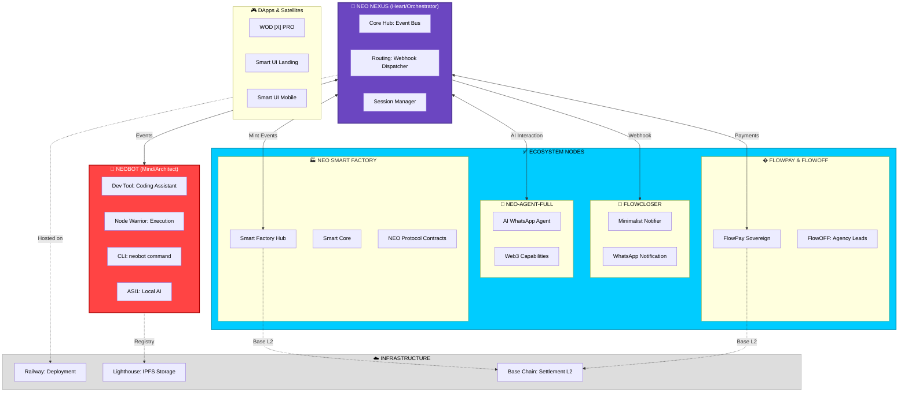

<!-- markdownlint-disable MD003 MD007 MD022 MD023 MD025 MD029 MD032 MD033 MD034 MD041 -->
```
░█▀█░█▀▀░█▀█░░░█▀█░█▀▄░█▀█░▀█▀░█▀█░█▀▀░█▀█░█░░
░█░█░█▀▀░█░█░░░█▀▀░█▀▄░█░█░░█░░█░█░█░░░█░█░█░░
░▀░▀░▀▀▀░▀▀▀░░░▀░░░▀░▀░▀▀▀░░▀░░▀▀▀░▀▀▀░▀▀▀░▀▀▀

```text
========================================================================
[####] Built on Moltbot ............................................ OK
[####] Web3 · Decentralized · Self-hosted .......................... OK
[####] Modular Ecosystem (New Protocol) ............................ OK
========================================================================
```

> **[📜 LEIA O MANIFESTO MODULAR](docs/neo-protocol/MODULAR_MANIFESTO.md)**: "Um sistema modular entre projetos que se falam."

<p align="center">
  
</p>

<p align="center">
  <a href="https://github.com/neomello/neobot/actions"></a>
  <a href="https://github.com/neomello/neobot/releases"></a>
  <a href="LICENSE"></a>
  <a href="https://files.lighthouse.storage/?referBy=cf37bdc80bcf4ff2bd162671c3f6b3fa"></a>
</p>

```text
========================================================================
                         WHAT IS NEØ PROTOCOL?
========================================================================
```

NEØ.BOT is a decentralized AI assistant control plane that runs on
your infrastructure, with your rules, following Web3 principles.
A code managed by the NEØ protocol.

Born from Moltbot's industrial-grade foundation. Hybrid architecture:

```text
┌────────────────────────────────────────────────────────────────┐
│ ▓▓▓ STACK                                                      │
├────────────────────────────────────────────────────────────────┤
│ └─ 30% OpenClaw Core  → Gateway, agent runtime (Stable)        │
│ └─ 70% NEØ Layer      → Warrior Node, IPFS, MIO Identity       │
└────────────────────────────────────────────────────────────────┘
```

Why it matters: traditional assistants lock you into centralized
platforms. NEØ gives you self-custodial, decentralization,
transparency, resilience, and privacy.

```text
=======================================================
          RECOGNITION & FOUNDATION
=======================================================
```

We recognize Moltbot and Peter Steinberger for building the most
sophisticated AI assistant control plane. NEØ extends that foundation.

> "Moltbot gave us the engine. NEØ Protocol is breaking the speed
> limits."

```text
┌────────────────────────────────────────────────────────────────┐
│ ▓▓▓ FROM OPENCLAW/MOLTBOT                                      │
├────────────────────────────────────────────────────────────────┤
│ └─ Gateway (WebSocket), Sovereign Channels (WA, TG)            │
│ └─ Pi agent runtime, security-first, health & Ledger           │
└────────────────────────────────────────────────────────────────┘

┌────────────────────────────────────────────────────────────────┐
│ ▓▓▓ NEØ ADDS                                                   │
├────────────────────────────────────────────────────────────────┤
│ └─ IPFS Skills Registry, Node Warrior Execution Environment    │
│ └─ MIO Identity Layer (mio-system), Web3 Signatures            │
│ └─ Lighthouse Storage (Perpetual Data Pinning)                 │
└────────────────────────────────────────────────────────────────┘
```

```text
=======================================================
                STORAGE PARTNERSHIP
=======================================================
```

NEØ Protocol uses **Lighthouse Storage** for decentralized, perpetual
IPFS storage. Lighthouse provides censorship-resistant, permanent storage
for our Skills Registry and content.

<a href="https://files.lighthouse.storage/?referBy=cf37bdc80bcf4ff2bd162671c3f6b3fa">
  
</a>

**Partner Code:** `cf37bdc80bcf4ff2bd162671c3f6b3fa`  
**Learn more:** [Lighthouse Storage](https://files.lighthouse.storage/?referBy=cf37bdc80bcf4ff2bd162671c3f6b3fa)

```text
=======================================================
                CORE FEATURES (RESUMO)
=======================================================
```

- IPFS Skills Registry (content-addressed, verifiable, censorship-
  resistant) — Powered by [Lighthouse Storage](https://files.lighthouse.storage/?referBy=cf37bdc80bcf4ff2bd162671c3f6b3fa)
- mio-system Identity (9 core identities, Web3 signatures)
- Gateway Extensions (IPFS PubSub, Nostr, Web3 Signer)
- Moltbot Core (stable): channels, agent runtime, security, Ledger

Setup e comandos: ver [**Guia de Início Rápido**](docs/core/QUICKSTART.md).

```text
=======================================================
             WHAT MAKES NEØ DIFFERENT?
=======================================================
```

- Hosting: your infrastructure (no vendor lock-in)
- Skills: IPFS decentralized (vs centralized)
- Identity: Web3 signatures (vs OAuth/API keys)
- Data: you own it; censorship-resistant; multi-node; open-source

Vision: decentralized AI mesh, federated learning, blockchain
integration, NFT-based skills, DAO governance. Phase 1 in progress.

```text
=======================================================
             ARCHITECTURE OVERVIEW
=======================================================
```



```text
=======================================================
             DOCUMENTATION
=======================================================
```

- **[REPOSITÓRIO DE DOCS (ÍNDICE)](docs/INDEX.md)** — Navegação centralizada
- **[SETUP.md](docs/core/SETUP.md)** — Instalação e comandos
- **[ARCHITECTURE_NEO_PROTOCOL.md](docs/core/ARCHITECTURE_NEO_PROTOCOL.md)** — Arquitetura completa
- **[NEXT_STEPS_V2.md](docs/core/NEXT_STEPS_V2.md)** — Roadmap 8 semanas
- **[ARCHITECTURE_VISUAL.md](docs/neo-protocol/ARCHITECTURE_VISUAL.md)** — Status visual das conexões

Upstream: <https://docs.molt.bot>

```text
=======================================================
             COMMUNITY & ROADMAP (RESUMO)
=======================================================
```

- Twitter/X: @neoprotocol | Telegram: @neoprotocol
- Email: neo@neoprotocol.space | Site: neoprotocol.space (em breve)
    
Roadmap: Phase 1.0 IN PROGRESS (Foundation, Extensions, Docs, Release
v1.0.0). Detalhes em [NEXT_STEPS_V2.md](docs/core/NEXT_STEPS_V2.md).

```text
=======================================================
             LICENSE & DISCLAIMER
=======================================================
```

- Moltbot Core (src/): MIT (upstream)
- NEØ Layer (neo/, skills/, dashboard/): MIT

NEØ Protocol is in active development. Phase 1.0 expected completion
Feb 2026. Some features experimental. Production use at your own risk
until v1.0.0.

```text
=======================================================
             CALL TO ACTION
=======================================================
```

Star the repo · Read [INDEX.md](docs/INDEX.md) · Check
[ARCHITECTURE_VISUAL.md](docs/neo-protocol/ARCHITECTURE_VISUAL.md) · Join
community for updates.

```

```text
┌─────────────────────────────────────────────────────────────────┐
│                                                                 │
│       █                                                         │
│   ▄███     NΞØ MELLØ                                            │
│  █  █ █    Core Architect · NΞØ Protocol                        │
│  █ █  █    neo@neoprotocol.space                                │
│   ███▀                                                          │
│  █                                                              │
│     "Code is law. Expand until chaos becomes protocol."         │
│                                                                 │
│     Security by design. Exploits find no refuge here.           │
│                                                                 │
└─────────────────────────────────────────────────────────────────┘
```
