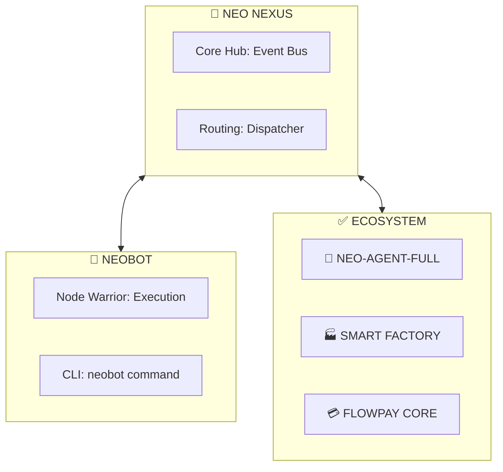

<!-- markdownlint-disable MD003 MD007 MD011 MD013 MD022 MD023 MD025 MD029 MD032 MD033 MD034 -->

```text
░█▀█░█▀▀░█▀█░░░█▀█░█▀▄░█▀█░▀█▀░█▀█░█▀▀░█▀█░█░░
░█░█░█▀▀░█░█░░░█▀▀░█▀▄░█░█░░█░░█░█░█░░░█░█░█░░
░▀░▀░▀▀▀░▀▀▀░░░▀░░░▀░▀░▀▀▀░░▀░░▀▀▀░▀▀▀░▀▀▀░▀▀▀

========================================
             NEO PROTOCOL
========================================
[####] Built on Moltbot ............ OK
[####] Web3 · Decentralized ........ OK
[####] Modular Ecosystem ........... OK
========================================
```

> **[📜 MANIFESTO MODULAR](docs/neo-protocol/MODULAR_MANIFESTO.md)**

<p align="center">
  
</p>

<p align="center">
  <a href="https://github.com/NEO-PROTOCOL/neobot/actions"></a>
  <a href="https://github.com/NEO-PROTOCOL/neobot/releases"></a>
  <a href="LICENSE"></a>
  <a href="https://files.lighthouse.storage/?referBy=cf37bdc80bcf4ff2bd162671c3f6b3fa"></a>
</p>

▓▓▓ WHAT IS NEO PROTOCOL?
────────────────────────────────────────
NEØ.BOT is a decentralized AI assistant
control plane that runs on your infra,
with your rules, following Web3 laws.

Born from Moltbot's industrial foundation.
Hybrid architecture:

- 30% Neobot Core
- 70% NEO Layer

```text
[####] NEO Layer (60%) ............. OK
[####] Neobot Core (40%) ........... OK
```

▓▓▓ RECOGNITION & FOUNDATION
────────────────────────────────────────
We recognize Moltbot and Peter Steinberger
for building the most sophisticated AI
assistant control plane. NEØ extends it.

> "Moltbot gave us the engine.
> NEØ Protocol is breaking the
> speed limits."

▓▓▓ FROM NEOBOT / MOLTBOT
────────────────────────────────────────
└─ Gateway (WebSocket)
└─ Sovereign Channels (WA, TG)
└─ Pi agent runtime
└─ Security-first & Ledger

▓▓▓ NEO ADDS
────────────────────────────────────────
└─ IPFS Skills Registry
└─ Node Warrior Environment
└─ MIO Identity (mio-system)
└─ Web3 Signatures
└─ Lighthouse Storage (Pinning)

## Storage Partnership

NEØ Protocol uses **Lighthouse Storage**
for decentralized, perpetual storage.

<p align="left">
  <a href="https://files.lighthouse.storage/?referBy=cf37bdc80bcf4ff2bd162671c3f6b3fa">
    
  </a>
</p>

**Partner Code:** `cf37bdc80bcf4ff2bd162671c3f6b3fa`

▓▓▓ CORE FEATURES
────────────────────────────────────────
└─ IPFS Skills Registry (Lighthouse)
└─ mio-system (9 core identities)
└─ Gateway Extensions (PubSub, Nostr)
└─ Neobot Core: Channels, Pi Runtime

## Architecture Overview



## Documentation

- **[INDEX](docs/INDEX.md)** — Entry point
- **[SETUP](docs/core/SETUP.md)** — Installation
- **[ROADMAP](docs/core/NEXT_STEPS_V2.md)** — Phase 1.0

## Community

- Twitter: @neoprotocol
- Email: neo@neoprotocol.space
- Status: Phase 1.0 IN PROGRESS

## License

- Moltbot Core: MIT (upstream)
- NEØ Layer: MIT

---

## Contributors

Thanks to all our neocontributors!

<!-- neocontributors-start -->

<a href="https://github.com/neomello"></a> <a href="https://github.com/buerbaumer"></a> <a href="https://github.com/search?q=Mariano%20Belinky"></a> <a href="https://github.com/search?q=Clawd"></a> <a href="https://github.com/search?q=Jarvis"></a> <a href="https://github.com/search?q=Rain"></a> <a href="https://github.com/search?q=Sash%20Catanzarite"></a> <a href="https://github.com/search?q=Ubuntu"></a> <a href="https://github.com/search?q=Zach%20Knickerbocker"></a>

<!-- neocontributors-end -->

▓▓▓ NΞØ MELLØ
────────────────────────────────────────
Core Architect · NΞØ Protocol
neo@neoprotocol.space

"Code is law. Expand until
chaos becomes protocol."

Security by design.
Explits find no refuge here.
────────────────────────────────────────
