```mermaid
graph TB
    subgraph NEOBOT["🎯 NEOBOT CORE (Interplanetary Warrior)"]
        CORE[Core: Gateway + Routing + Sessions]
        MIO[MIO System: Identity ID]
        WARRIOR[Node Warrior: Sovereign Exec]
        CLI[CLI: neobot command]
    end

    subgraph ACTIVE_NODES["✅ ECOSYSTEM NODES"]
        subgraph FACTORY_STACK["🏭 NEO SMART FACTORY"]
            FACTORY[Smart Factory Hub]
            S_CORE[Smart Core]
            S_CLI[Smart CLI]
            S_UI[Smart UI PWA]
            NEO_CONTRACTS[NEO Protocol Contracts]
        end
        
        subgraph FLOWPAY_OS["💰 FLOWPAY"]
            FLOWPAY[FlowPay Sovereign]
            FP_CORE["FlowPay-core (OSS)"]
        end

        subgraph FLUXX_DAO["🌊 FLUXX DAO"]
            F_CONTRACTS[Fluxx Contracts]
            F_APP[Fluxx DAO App]
        end
        
        subgraph FLOWOFF_AREA["🚀 FLOWOFF AGENCY"]
            AGENT_FO[Agent FlowOFF]
            CEO_MINI["CEO Escalável MiniApp"]
            FO_LANDING[FlowOFF Landing/PWA]
        end
    end

    subgraph DAPPS["🎮 DApps & Satellites"]
        WOD["WOD [X] PRO"]
        SUI_LAND["Smart UI Landing"]
        SUI_MOB["Smart UI Mobile"]
    end

    subgraph INFRA_SERVICES["☁️ INFRASTRUCTURE"]
        ANTHROPIC[Anthropic: Claude 3.5]
        RAILWAY[Railway: Deployment]
        LIGHTHOUSE[Lighthouse: IPFS Storage]
        BASE[Base Chain: Settlement L2]
    end

    %% Connections
    CORE --- MIO
    CORE --- CLI
    CORE --- WARRIOR
    
    %% AI & Hosting
    CORE --> ANTHROPIC
    NEOBOT -.->|Hosted on| RAILWAY
    CORE -.->|Registry| LIGHTHOUSE
    
    %% Orchestration
    CORE <-->|Orchestration| FACTORY
    CORE <-->|Payments| FLOWPAY
    CORE <-->|Coordination| AGENT_FO
    CORE <-->|Governance| FLUXX_DAO
    
    %% Blockchain Layer
    S_CORE -.->|Base L2| BASE
    FLOWPAY -.->|Base L2| BASE
    F_CONTRACTS -.->|Base L2| BASE
    NEO_CONTRACTS -.->|Base L2| BASE
    
    %% App Relationships
    WOD -.->|Uses| FACTORY
    NEO_CONTRACTS <-->|Governance/Registry| FACTORY
    F_APP -.->|Uses| F_CONTRACTS
    SUI_LAND -.->|Drives to| S_UI
    SUI_MOB -.->|Interacts| S_UI
    CEO_MINI -.->|Connected to| AGENT_FO
    
    %% Revenue Loop
    FLOWPAY --- FP_GATE
    FO_LANDING -->|Leads| AGENT_FO

    %% Styling
    classDef core fill:#ff4444,stroke:#aa0000,stroke-width:2px,color:#fff
    classDef factory fill:#00ccff,stroke:#0088aa,stroke-width:2px,color:#000
    classDef flowpay fill:#00ffcc,stroke:#00aba9,stroke-width:2px,color:#000
    classDef fluxx fill:#4488ff,stroke:#0055aa,stroke-width:2px,color:#fff
    classDef flowoff fill:#ff00ff,stroke:#aa00aa,stroke-width:2px,color:#fff
    classDef infra fill:#dddddd,stroke:#999,stroke-width:1px,color:#000
    classDef dapp fill:#ffcc00,stroke:#aa8800,stroke-width:2px,color:#000
    
    class CORE,MIO,CLI,WARRIOR core
    class FACTORY,S_CORE,S_CLI,S_UI,NEO_CONTRACTS factory
    class FLOWPAY,FP_CORE flowpay
    class F_CONTRACTS,F_APP fluxx
    class AGENT_FO,CEO_MINI,FO_LANDING flowoff
    class ANTHROPIC,RAILWAY,BASE,LIGHTHOUSE infra
    class WOD,SUI_LAND,SUI_MOB dapp
```

<!-- markdownlint-disable MD003 MD007 MD022 MD023 MD025 MD029 MD032 MD033 MD034 MD041 -->
```
░█▀█░█▀▀░█▀█░░░█▀█░█▀▄░█▀█░▀█▀░█▀█░█▀▀░█▀█░█░░
░█░█░█▀▀░█░█░░░█▀▀░█▀▄░█░█░░█░░█░█░█░░░█░█░█░░
░▀░▀░▀▀▀░▀▀▀░░░▀░░░▀░▀░▀▀▀░░▀░░▀▀▀░▀▀▀░▀▀▀░▀▀▀

```text
========================================================================
[####] Built on Moltbot ............................................ OK
[####] Web3 · Decentralized · Self-hosted .......................... OK
[####] Modular Ecosystem (New Protocol) ............................ OK
========================================================================
```

> **[📜 LEIA O MANIFESTO MODULAR](docs/neo-protocol/MODULAR_MANIFESTO.md)**: "Um sistema modular entre projetos que se falam."

<p align="center">
  
</p>

<p align="center">
  <a href="https://github.com/neomello/neobot/actions"></a>
  <a href="https://github.com/neomello/neobot/releases"></a>
  <a href="LICENSE"></a>
  <a href="https://files.lighthouse.storage/?referBy=cf37bdc80bcf4ff2bd162671c3f6b3fa"></a>
</p>

```text
========================================================================
                         WHAT IS NEØ PROTOCOL?
========================================================================
```

NEØ.BOT is a decentralized AI assistant control plane that runs on
your infrastructure, with your rules, following Web3 principles.
A code managed by the NEØ protocol.

Born from Moltbot's industrial-grade foundation. Hybrid architecture:

```text
┌────────────────────────────────────────────────────────────────┐
│ ▓▓▓ STACK                                                      │
├────────────────────────────────────────────────────────────────┤
│ └─ 30% OpenClaw Core  → Gateway, agent runtime (Stable)       │
│ └─ 70% NEØ Layer      → Warrior Node, IPFS, MIO Identity       │
└────────────────────────────────────────────────────────────────┘
```

Why it matters: traditional assistants lock you into centralized
platforms. NEØ gives you self-sovereignty, decentralization,
transparency, resilience, and privacy.

```text
=======================================================
          RECOGNITION & FOUNDATION
=======================================================
```

We recognize Moltbot and Peter Steinberger for building the most
sophisticated AI assistant control plane. NEØ extends that foundation.

> "Moltbot gave us the engine. NEØ Protocol is breaking the speed
> limits."

```text
┌────────────────────────────────────────────────────────────────┐
│ ▓▓▓ FROM OPENCLAW/MOLTBOT                                      │
├────────────────────────────────────────────────────────────────┤
│ └─ Gateway (WebSocket), Sovereign Channels (WA, TG)           │
│ └─ Pi agent runtime, security-first, health & Ledger           │
└────────────────────────────────────────────────────────────────┘

┌────────────────────────────────────────────────────────────────┐
│ ▓▓▓ NEØ ADDS                                                   │
├────────────────────────────────────────────────────────────────┤
│ └─ IPFS Skills Registry, Node Warrior Execution Environment   │
│ └─ MIO Identity Layer (mio-system), Web3 Signatures           │
│ └─ Lighthouse Storage (Perpetual Data Pinning)                 │
└────────────────────────────────────────────────────────────────┘
```

```text
=======================================================
                STORAGE PARTNERSHIP
=======================================================
```

NEØ Protocol uses **Lighthouse Storage** for decentralized, perpetual
IPFS storage. Lighthouse provides censorship-resistant, permanent storage
for our Skills Registry and content.

<a href="https://files.lighthouse.storage/?referBy=cf37bdc80bcf4ff2bd162671c3f6b3fa">
  
</a>

**Partner Code:** `cf37bdc80bcf4ff2bd162671c3f6b3fa`  
**Learn more:** [Lighthouse Storage](https://files.lighthouse.storage/?referBy=cf37bdc80bcf4ff2bd162671c3f6b3fa)

```text
=======================================================
                CORE FEATURES (RESUMO)
=======================================================
```

- IPFS Skills Registry (content-addressed, verifiable, censorship-
  resistant) — Powered by [Lighthouse Storage](https://files.lighthouse.storage/?referBy=cf37bdc80bcf4ff2bd162671c3f6b3fa)
- mio-system Identity (9 core identities, Web3 signatures)
- Gateway Extensions (IPFS PubSub, Nostr, Web3 Signer)
- Moltbot Core (stable): channels, agent runtime, security, Ledger

Setup e comandos: ver [**Guia de Início Rápido**](docs/core/QUICKSTART.md).

```text
=======================================================
             WHAT MAKES NEØ DIFFERENT?
=======================================================
```

- Hosting: your infrastructure (no vendor lock-in)
- Skills: IPFS decentralized (vs centralized)
- Identity: Web3 signatures (vs OAuth/API keys)
- Data: you own it; censorship-resistant; multi-node; open-source

Vision: decentralized AI mesh, federated learning, blockchain
integration, NFT-based skills, DAO governance. Phase 1 in progress.

```text
=======================================================
             ARCHITECTURE OVERVIEW
=======================================================
```



```text
=======================================================
             DOCUMENTATION
=======================================================
```

- **[REPOSITÓRIO DE DOCS (ÍNDICE)](docs/INDEX.md)** — Navegação centralizada
- **[SETUP.md](docs/core/SETUP.md)** — Instalação e comandos
- **[ARCHITECTURE_NEO_PROTOCOL.md](docs/core/ARCHITECTURE_NEO_PROTOCOL.md)** — Arquitetura completa
- **[NEXT_STEPS_V2.md](docs/core/NEXT_STEPS_V2.md)** — Roadmap 8 semanas
- **[ARCHITECTURE_VISUAL.md](docs/neo-protocol/ARCHITECTURE_VISUAL.md)** — Status visual das conexões

Upstream: <https://docs.molt.bot>

```text
=======================================================
             COMMUNITY & ROADMAP (RESUMO)
=======================================================
```

- Twitter/X: @neoprotocol | Telegram: @neoprotocol
- Email: neo@neoprotocol.space | Site: neoprotocol.space (em breve)

Roadmap: Phase 1.0 IN PROGRESS (Foundation, Extensions, Docs, Release
v1.0.0). Detalhes em [NEXT_STEPS_V2.md](docs/core/NEXT_STEPS_V2.md).

```text
=======================================================
             LICENSE & DISCLAIMER
=======================================================
```

- Moltbot Core (src/): MIT (upstream)
- NEØ Layer (neo/, skills/, dashboard/): MIT

NEØ Protocol is in active development. Phase 1.0 expected completion
Feb 2026. Some features experimental. Production use at your own risk
until v1.0.0.

```text
=======================================================
             CALL TO ACTION
=======================================================
```

Star the repo · Read [INDEX.md](docs/INDEX.md) · Check
[ARCHITECTURE_VISUAL.md](docs/neo-protocol/ARCHITECTURE_VISUAL.md) · Join
community for updates.

```

```text
┌─────────────────────────────────────────────────────────────────┐
│                                                                 │
│       █                                                         │
│   ▄███     NΞØ MELLØ                                            │
│  █  █ █    Core Architect · NΞØ Protocol                        │
│  █ █  █    neo@neoprotocol.space                                │
│   ███▀                                                          │
│  █                                                              │
│     "Code is law. Expand until chaos becomes protocol."         │
│                                                                 │
│     Security by design. Exploits find no refuge here.           │
│                                                                 │
└─────────────────────────────────────────────────────────────────┘
```