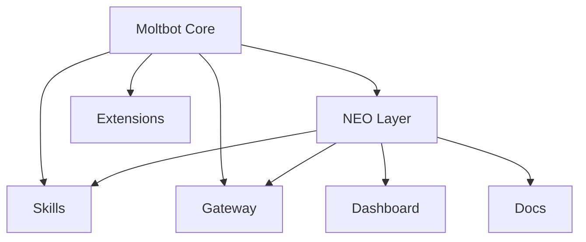

# NEØ Protocol — Setup e Desenvolvimento

<!-- markdownlint-disable MD034 -->

Guia técnico para clonar, instalar, buildar e contribuir no repositório NEØ Protocol.

---

## Pré-requisitos

- **Node.js** ≥ 22 (recomendado 22.12+)
- **pnpm** (recomendado) ou npm/bun
- **IPFS** (opcional, para features NEØ)

---

## Clone e instalação

```bash
# Clone
git clone https://github.com/neomello/neobot.git
cd neobot

# Dependências
pnpm install

# Build
pnpm build

# Onboarding (opcional)
pnpm neobot onboard --install-daemon
```

---

## Comandos básicos

```bash
# Gateway
pnpm neobot gateway --port 18789

# Saúde do sistema
pnpm neobot health

# Skills
pnpm neobot skills list

# Info do protocolo NEØ
pnpm neobot neo:info
```

---

## Comandos NEØ

### Skills (IPFS Registry)

```bash
pnpm neobot neo:skill:publish ./skills/my-skill/
pnpm neobot neo:skill:install ipfs-status@1.0.0
pnpm neobot neo:skill:search "blockchain"
```

### Identity (mio-system)

```bash
pnpm neobot neo:identity:create --name "My Bot" --role developer
pnpm neobot neo:identity:list
pnpm neobot neo:identity:verify mio-abc12345
```

---

## Estrutura do projeto

```text
neobot/
├── src/           # Moltbot Core (sincronizado upstream)
├── neo/           # NEØ Protocol Layer (registry, identity, cli, sdk)
├── skills/        # Skills NEØ (ipfs, asi1, smart-factory, flowpay, ...)
├── dashboard/     # UI de gestão (iOS-style)
├── docs-neo/      # Docs self-hosted (em construção)
├── SETUP.md       # Este arquivo
└── README.md      # Visão e identidade do projeto
```

Detalhes: [ARCHITECTURE_NEO_PROTOCOL.md](ARCHITECTURE_NEO_PROTOCOL.md)

---

## High-Level Diagram



---

## NEO Protocol Layer (Overview)

```text
========================================
         NEO PROTOCOL LAYER
========================================
```

▓▓▓ PURPOSE
────────────────────────────────────────
└─ Decentralized layer on Moltbot
└─ Sovereign identity + registry
└─ Web3-native gateway extensions
└─ CLI + SDK for developers

▓▓▓ STRUCTURE
────────────────────────────────────────

```text
neo/
├── registry/   # IPFS skills
├── identity/   # mio-system ID
├── gateway/    # Web3 gateways
├── cli/        # NEO CLI cmds
└── sdk/        # Developer SDK
```

▓▓▓ QUICK START
────────────────────────────────────────

```bash
pnpm install
pnpm neobot neo:info
pnpm neobot neo:skill:list
pnpm neobot neo:identity:create \
  --name "My Bot"
```

Docs: ARCHITECTURE_NEO_PROTOCOL.md

---

## Como contribuir

1. **Fork** o repositório no GitHub.
2. **Clone** seu fork e crie uma branch:
   - NEØ Layer: `git checkout -b neo/feature-xyz`
   - Moltbot Core (sync/bugfix): `git checkout -b upstream-sync`
3. **Commit** com Conventional Commits:
   - `feat(neo): add xyz`
   - `fix(neo): ...`
   - `docs: ...`
   - `chore(upstream): merge moltbot updates`
4. **Push** e abra um PR.

**Regras:**

- Alterações em `src/` (Moltbot Core): discutir antes.
- Alterações em `neo/`, `skills/`, `dashboard/`: contribuição livre.
- Documentação: seguir [.cursor/standards/markdown-neo.md](.cursor/standards/markdown-neo.md).

---

## CI / GitHub Actions

▓▓▓ MODO PADRÃO (SLIM)
────────────────────────────────────────
└─ Execução leve por padrão
└─ Não bloqueia trabalho diário
└─ Node: lint, test, build,
   protocol, format
└─ install-check + secrets
└─ Audit: falha apenas em
   vulnerabilidades críticas
└─ Docker: apenas em tag `v*`
└─ Install Smoke: apenas em PR

▓▓▓ CI COMPLETO
────────────────────────────────────────
└─ Windows + Android
└─ Configurar: Settings >
   Secrets and variables >
   Actions > Variables
└─ Adicionar: NEO_CI_FULL = true
└─ Remover para voltar ao slim
└─ Útil antes de release ou
   ao sincronizar upstream

▓▓▓ BUN RUNTIME
────────────────────────────────────────
└─ Em `.github/workflows/ci.yml`
└─ Job `checks` na matrix
└─ Descomentar 2 entradas
   `runtime: bun`
└─ Para rodar testes/build
   com Bun

────────────────────────────────────────
CI flexível: peso controlado pela
variável NEO_CI_FULL e pela matrix
(se Bun estiver habilitado).

---

## Documentação

- [README.md](README.md) — Visão, identidade e reconhecimento
- [ARCHITECTURE_NEO_PROTOCOL.md](ARCHITECTURE_NEO_PROTOCOL.md) — Arquitetura completa NEØ
- [NEXT_STEPS_V2.md](NEXT_STEPS_V2.md) — Roadmap de implementação
- [NEO_PROTOCOL_KICKOFF.md](NEO_PROTOCOL_KICKOFF.md) — Quick start conceitual
- [.cursor/standards/markdown-neo.md](.cursor/standards/markdown-neo.md) — Padrão de escrita

Upstream Moltbot: <https://docs.molt.bot>

---

## Licença

- **Moltbot Core (`src/`):** MIT (upstream)
- **NEØ Layer (`neo/`, `skills/`, `dashboard/`):** MIT

Ver [LICENSE](LICENSE).

┌─────────────────────────────────────────────────────────────────┐
│ ▓▓▓ NΞØ MELLØ                                                   │
│     Core Architect · NΞØ Protocol                               │
│     neo@neoprotocol.space                                       │
│                                                                 │
│     "Code is law. Expand until chaos becomes protocol."         │
│                                                                 │
│     Security by design. Exploits find no refuge here.           │
└─────────────────────────────────────────────────────────────────┘
