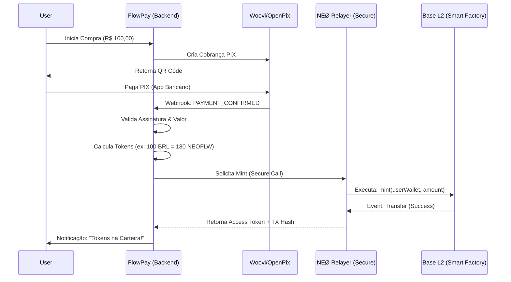

# 🌉 NEØ Smart Factory Bridge: Conectando FlowPay

**Status:** Draft Architecture  
**Node:** NEØ  
**Last Update:** 02 Fev 2026

Este documento detalha a arquitetura técnica para conectar o **FlowPay Gateway** (PIX) à **NEØ Smart Factory** (Tokens/Blockchain), permitindo o mint automático de tokens `$NEOFLW` ou acesso `AccessPass` após a confirmação de pagamento.

---

## 🏗️ Arquitetura de Alto Nível

O fluxo segue o padrão **"Oracle/Relayer"**: O FlowPay atua como um oráculo de pagamentos fiat (BRL/PIX) que autoriza uma ação on-chain.



---

## 🔧 Componentes da Integração

### 1. Smart Contract (Interface)

O contrato `NeoTokenV2.sol` (ou equivalente na Smart Factory) deve expor uma função de mint restrita.

```solidity
// Interface esperada no Smart Contract
interface INeoToken {
    // Apenas endereços com ROLE_MINTER podem chamar
    function mint(address to, uint256 amount) external;
}
```

### 2. Credenciais de Acesso (Environment)

No ambiente do FlowPay (Netlify/Railway), as seguintes variáveis são necessárias:

```bash
# Endereço do contrato deployado pela Smart Factory
SMART_FACTORY_CONTRACT_ADDRESS="0x..."

# RPC da rede Base (ou network alvo)
RPC_URL="https://base-mainnet.g.alchemy.com/v2/..."

# Chave Privada da carteira com permissão de MINTER (CUIDADO!)
# Recomendado: Usar um serviço de KMS ou Secret Manager
RELAYER_PRIVATE_KEY="0x..."
```

### 3. Implementação do Service (Node.js/TypeScript)

Este é o código que deve rodar no backend do FlowPay (ex: em `functions/mint-handler.ts`).

```typescript
import { createWalletClient, createPublicClient, http, parseEther, defineChain } from 'viem';
import { privateKeyToAccount } from 'viem/accounts';
import { base } from 'viem/chains';

// ABI Mínima para Mint
const MINT_ABI = [
  {
    inputs: [
      { name: 'to', type: 'address' },
      { name: 'amount', type: 'uint256' }
    ],
    name: 'mint',
    outputs: [],
    stateMutability: 'nonpayable',
    type: 'function'
  }
];

export async function mintTokens(userAddress: string, amountTokens: string) {
  // 1. Configurar Cliente e Conta
  const account = privateKeyToAccount(process.env.RELAYER_PRIVATE_KEY as `0x${string}`);
  
  const client = createWalletClient({
    account,
    chain: base,
    transport: http(process.env.RPC_URL)
  });

  const publicClient = createPublicClient({
    chain: base,
    transport: http(process.env.RPC_URL)
  });

  console.log(`🚀 Iniciando Mint de ${amountTokens} para ${userAddress}...`);

  // 2. Executar Transação
  try {
    const { request } = await publicClient.simulateContract({
      address: process.env.SMART_FACTORY_CONTRACT_ADDRESS as `0x${string}`,
      abi: MINT_ABI,
      functionName: 'mint',
      args: [userAddress, parseEther(amountTokens)],
      account
    });

    const hash = await client.writeContract(request);

    console.log(`✅ Mint Enviado! TX: ${hash}`);
    return hash;

  } catch (error) {
    console.error("❌ Erro no Mint:", error);
    throw error;
  }
}
```

---

## 🛡️ Segurança & Melhores Práticas

1.  **Rate Limiting:** Implementar limites para evitar que um bug ou ataque drene o supply de tokens.
2.  **Validação de Webhook:** Verificar SEMPRE a assinatura `x-openpix-signature` ou equivalente para garantir que a notificação de pagamento é legítima.
3.  **Idempotência:** Garantir que o mesmo `charge_id` não gere tokens duas vezes (usar um banco de dados para rastrear `charge_id` processados).
4.  **Role Separation:** A carteira `RELAYER_PRIVATE_KEY` deve ter permissão *apenas* para mintar, e não deve ser a carteira "Owner" do contrato completo.

## 🚀 Próximos Passos para Implementação

1.  [ ] **Deploy:** Garantir que o contrato está na Base e tem a função `mint` acessível.
2.  [ ] **Config:** Adicionar variáveis de ambiente no FlowPay.
3.  [ ] **Code:** Criar o serviço `mint-service.ts` no FlowPay usando o snippet acima.
4.  [ ] **Integration:** Chamar `mintTokens()` dentro do webhook de sucesso do PIX.
