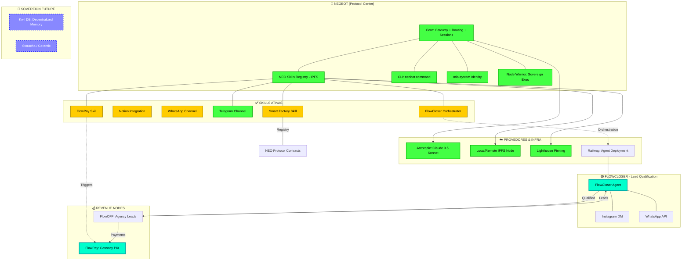

# NΞØ PROTOCOL - Visual Architecture

Este diagrama reflete o estado atual ("Organismo Vivo") do projeto, mapeando conexões ativas, pendentes e futuras.

## 🗺️ Legenda de Status

| Cor | Significado | Descrição |
| :--- | :--- | :--- |
| **Verde (Connected)** | Ativo & Verificado | Código implementado, build passando e comunicação estável. |
| **Amarelo (Warning)** | Pendente / Configuração | Skill existe no repositório mas requer chaves de API ou setup final. |
| **Azul Dash (Future)** | Roadmap | Funcionalidade planejada em fase de especificação (ex: Kwil DB). |
| **Ciano (Active Node)** | Gerador de Valor | Componentes que estão rodando e gerando impacto direto no negócio. |

## 🔗 Próximas Conexões Críticas

1.  **WhatsApp Channel (WA_SKILL)**: Finalizar o login via `wacli` para automatização de disparo de boletos/PIX.
2.  **Notion Sync**: Automatizar o reporte de leads qualificados do FlowCloser diretamente para o Workspace de vendas.
3.  **Smart Factory**: Ativação dos contratos inteligentes para tokenização das entregas da agência.

---
## 🌐 Networking Map (Railway Internal)

Para otimizar a latência e aumentar a segurança, o ecossistema utiliza a rede privada do Railway:

| Serviço | Domínio Interno (.railway.internal) | Protocolo |
| :--- | :--- | :--- |
| **NEØ Dashboard** | `neo-dashboard` | HTTP (Port: 3000) |
| **NEØ Agent** | `neo-agent` | HTTP (Port: 3000) / WS |
| **Lighthouse IPFS** | `lighthouse-gateway` | HTTP |

---
*Ultima atualização: 01 Fev 2026*
