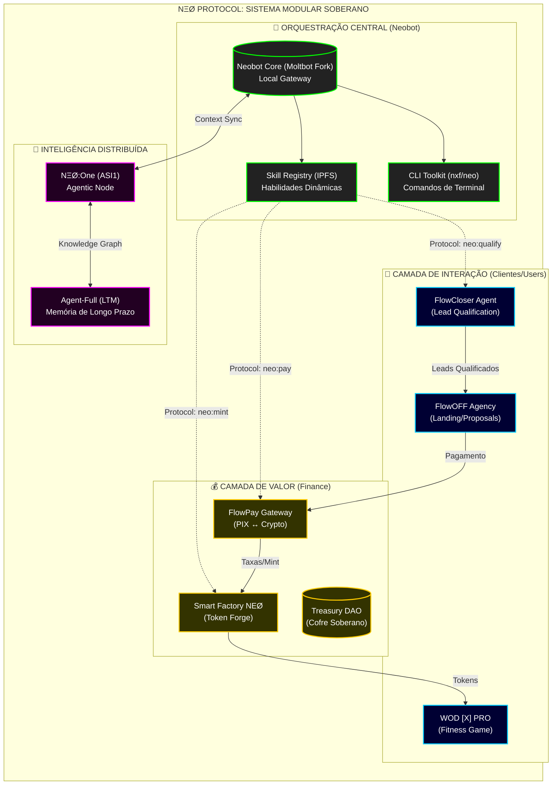

### 📜 Regras de Ouro do Sistema Modular (A Lei de Ferro)

1.  **Soberania dos Nós**: Cada caixa acima (Projeto) deve funcionar sozinha. Se o `Neobot` desligar, o `FlowPay` continua processando pagamentos e a `Agência` continua captando leads.
2.  **Protocolo > Acoplamento**: Jamais `import` código de um projeto dentro de outro. Use APIs, Webhooks ou Skills do Protocolo (`neo:skill`).
3.  **Segurança Centralizada**: Segredos ficam no **Bitwarden**. Chaves (`.env`) nunca são commitadas. O deploy é feito por pipelines autorizados.
4.  **Estado Descentralizado**: Dados críticos vivem no IPFS ou na Blockchain (Base/Polygon). Não dependemos de bancos de dados proprietários únicos.

---
**Status da Auditoria (01/Fev/2026):**
- [x] Agência FlowOFF: Mapeada
- [x] FlowPay: Mapeado
- [x] Smart Factory: Integrada
- [x] WOD [X] PRO: Documentação Encontrada
