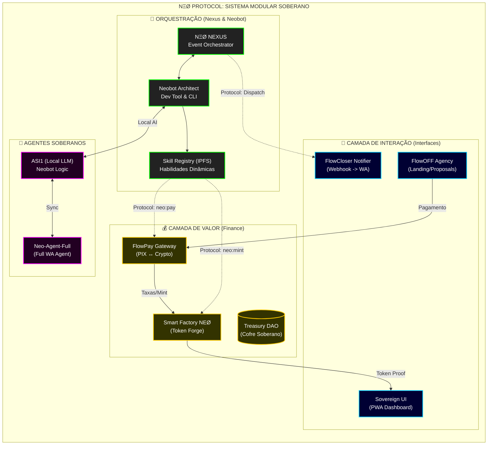

```mermaid
graph TB
    subgraph NEW_PROTOCOL_MODULAR_SYSTEM["NΞØ PROTOCOL: SISTEMA MODULAR SOBERANO"]
        direction TB

        %% ORQUESTRAÇÃO CENTRAL (O Cérebro & Coração)
        subgraph ORCHESTRATION["🧠 ORQUESTRAÇÃO (Nexus & Neobot)"]
            NEXUS["NΞØ NEXUS<br/>Event Orchestrator"]
            NEOBOT["Neobot Architect<br/>Dev Tool & CLI"]
            SKILLS["Skill Registry (IPFS)<br/>Habilidades Dinâmicas"]
            NEXUS <--> NEOBOT
            NEOBOT --> SKILLS
        end

        %% CAMADA DE VALOR (O Dinheiro)
        subgraph VALUE_LAYER["💰 CAMADA DE VALOR (Finance)"]
            FLOWPAY["FlowPay Gateway<br/>(PIX ↔ Crypto)"]
            SMART_FACTORY["Smart Factory NEØ<br/>(Token Forge)"]
            TREASURY[("Treasury DAO<br/>(Cofre Soberano)")]
        end

        %% CAMADA DE INTERAÇÃO (A Frente)
        subgraph FRONT_LAYER["📲 CAMADA DE INTERAÇÃO (Interfaces)"]
            FLOWOFF["FlowOFF Agency<br/>(Landing/Proposals)"]
            FLOWCLOSER["FlowCloser Notifier<br/>(Webhook -> WA)"]
            SOVEREIGN_UI["Sovereign UI<br/>(PWA Dashboard)"]
        end

        %% AGENTES & INTELIGÊNCIA (A Rede Neural)
        subgraph INTELLIGENCE["🤖 AGENTES SOBERANOS"]
            NEO_AGENT_FULL["Neo-Agent-Full<br/>(Full WA Agent)"]
            ASI1["ASI1 (Local LLM)<br/>Neobot Logic"]
        end

        %% PROTOCOLOS & CONEXÕES (As Sinapses)
        %% Comunicação Assíncrona via Protocolo
        NEXUS -.->|Protocol: Dispatch| FLOWCLOSER
        SKILLS -.->|Protocol: neo:pay| FLOWPAY
        SKILLS -.->|Protocol: neo:mint| SMART_FACTORY

        %% Fluxo de Negócio (O Ciclo de Vida)
        FLOWOFF -->|Pagamento| FLOWPAY
        FLOWPAY -->|Taxas/Mint| SMART_FACTORY
        SMART_FACTORY -->|Token Proof| SOVEREIGN_UI

        %% Memória e Contexto
        NEOBOT <-->|Local AI| ASI1
        ASI1 <-->|Sync| NEO_AGENT_FULL

    end

    %% ESTILO DO DIAGRAMA
    classDef core fill:#222,stroke:#0f0,stroke-width:2px,color:#fff
    classDef money fill:#330,stroke:#fc0,stroke-width:2px,color:#fff
    classDef front fill:#003,stroke:#0cf,stroke-width:2px,color:#fff
    classDef ai fill:#202,stroke:#f0f,stroke-width:2px,color:#fff
    
    class NEOBOT,SKILLS,NEXUS core
    class FLOWPAY,SMART_FACTORY,TREASURY money
    class FLOWOFF,FLOWCLOSER,SOVEREIGN_UI front
    class ASI1,NEO_AGENT_FULL ai
```

### 📜 Regras de Ouro do Sistema Modular (A Lei de Ferro)

1.  **Soberania dos Nós**: Cada caixa acima (Projeto) deve funcionar sozinha. Se o `Neobot` desligar, o `FlowPay` continua processando pagamentos e a `Agência` continua captando leads.
2.  **Protocolo > Acoplamento**: Jamais `import` código de um projeto dentro de outro. Use APIs, Webhooks ou Skills do Protocolo (`neo:skill`).
3.  **Segurança Centralizada**: Segredos ficam no **Bitwarden**. Chaves (`.env`) nunca são commitadas. O deploy é feito por pipelines autorizados.
4.  **Estado Descentralizado**: Dados críticos vivem no IPFS ou na Blockchain (Base/Polygon). Não dependemos de bancos de dados proprietários únicos.

---
**Status da Auditoria (01/Fev/2026):**
- [x] Agência FlowOFF: Mapeada
- [x] FlowPay: Mapeado
- [x] Smart Factory: Integrada
- [x] WOD [X] PRO: Documentação Encontrada
